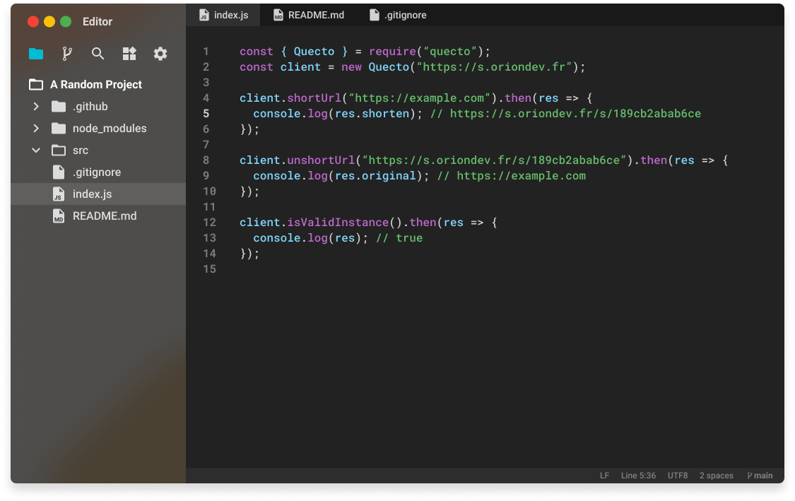

# node-quecto
node-quecto is the official Node.js client for [Quecto](https://github.com/oriionn/quecto).



## Installation
```bash
npm install quecto
```

## Usage

### Create a client
```js
const { Quecto } = require('quecto');
const client = new Quecto("https://s.oriondev.fr");
```

### Shorten a link
```js
const { Quecto } = require('quecto');
const client = new Quecto("https://s.oriondev.fr");

client.shortUrl("https://example.com").then((res) => {
    console.log(res.shorten);
}).catch((err) => {
    console.error(err);
});
```

### Unshorten a link
```js
const { Quecto } = require('quecto');
const client = new Quecto("https://s.oriondev.fr");

client.unshortUrl("https://s.oriondev.fr/s/189cb2abab6ce").then((res) => {
    console.log(res.url);
}).catch((err) => {
    console.error(err);
});
```

### Verify if a domain is a Quecto instance
```js
const { Quecto } = require('quecto');
const client = new Quecto("https://s.oriondev.fr");

client.isValidInstance().then((res) => {
    console.log(res);
}).catch((err) => {
    console.error(err);
});
```

## License
[GPL3](https://github.com/oriionn/node-quecto/blob/main/LICENSE)

## Contributors
[]()